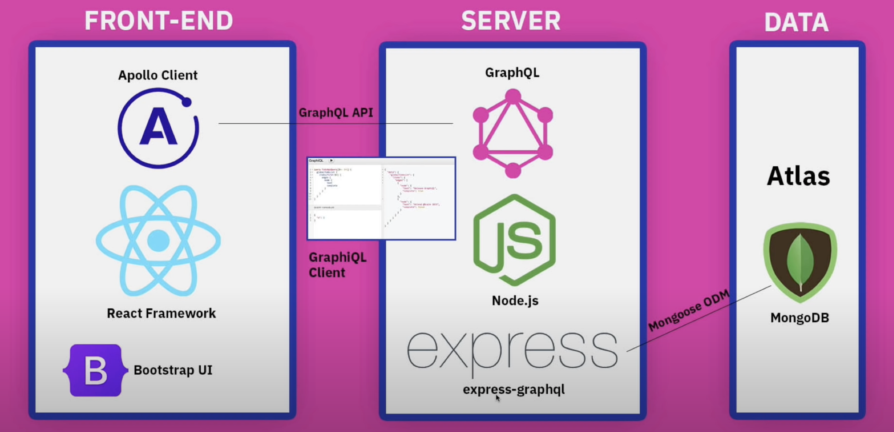
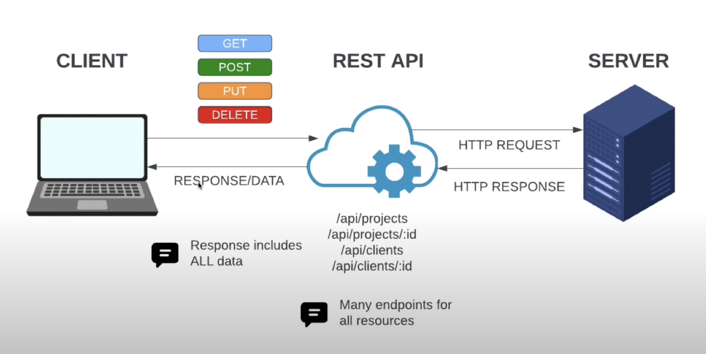
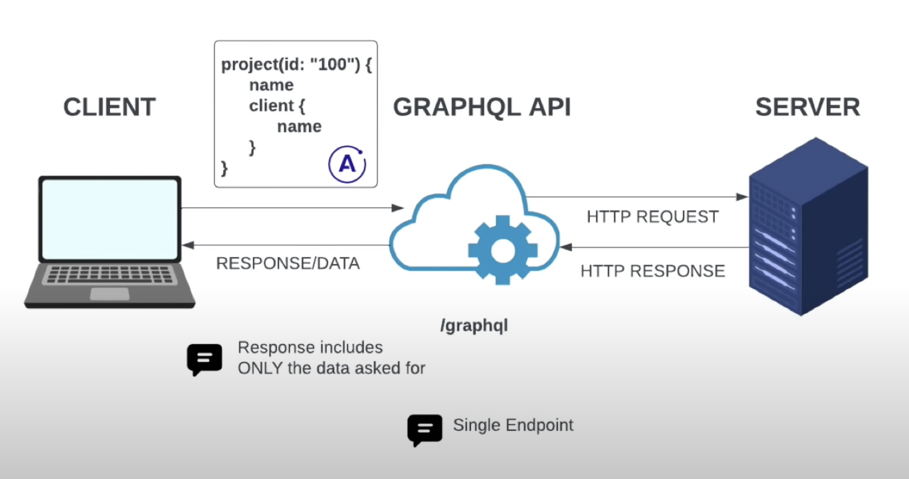

# Project Management System (MERN Stack with K8s & ArgoCD)

A comprehensive project management system built using the MERN stack (MongoDB, Express.js, React, Node.js), containerized with Docker, and deployed using Kubernetes and ArgoCD for continuous deployment.

[](https://github.com/mdarif/project-management/actions/workflows/docker.yml)

# Architecture
A Full Stack Dockerize MERN app with GraphQL Server/Client.



### How REST API works?



### How GraphQL API works?



## 🌟 Features

- Full-stack MERN application
- GraphQL API implementation
- Docker containerization
- Kubernetes orchestration
- ArgoCD for GitOps continuous deployment
- Client & Project management functionality
- Modern React frontend with responsive design

## 🏗 Architecture

### Tech Stack
- **Frontend**: React.js
- **Backend**: Node.js with Express
- **Database**: MongoDB
- **API**: GraphQL
- **Container Runtime**: Docker
- **Container Orchestration**: Kubernetes
- **Continuous Deployment**: ArgoCD

### Project Structure
```
project-management-k8s-argocd/
├── client/                      # React frontend application
│   ├── Dockerfile
│   ├── package.json
│   ├── public/
│   │   ├── index.html
│   │   └── manifest.json
│   └── src/
│       ├── components/
│       │   ├── AddClientModal.jsx
│       │   ├── AddProjectModal.jsx
│       │   ├── ClientInfo.jsx
│       │   ├── ClientRow.jsx
│       │   ├── Clients.jsx
│       │   ├── DeleteProjectButton.jsx
│       │   ├── EditProjectForm.jsx
│       │   ├── Header.jsx
│       │   ├── ProjectCard.jsx
│       │   └── Projects.jsx
│       ├── mutations/
│       ├── queries/
│       └── App.js
├── server/                      # Node.js backend application
│   ├── Dockerfile
│   ├── config/
│   │   └── db.js               # Database configuration
│   ├── models/
│   │   ├── Client.js           # Client MongoDB model
│   │   └── Project.js          # Project MongoDB model
│   ├── schema/
│   │   └── schema.js           # GraphQL schema
│   ├── .env                    # Environment variables
│   ├── index.js                # Server entry point
│   └── package.json
├── k8s/                        # Kubernetes manifests
│   ├── backend.yaml            # Backend deployment and service
│   ├── frontend.yaml           # Frontend deployment and service
│   ├── mongodb.yaml            # MongoDB deployment
│   ├── mongodb-pv-pvc.yaml     # MongoDB persistence
│   ├── configmap.yaml          # ConfigMap for environment variables
│   ├── secret.yaml             # Secrets configuration
│   ├── init-container-script.yaml
│   ├── rbac.yaml               # RBAC configurations
│   └── deploy.sh               # Deployment script
├── .github/
│   └── workflows/
│       └── docker-build.yml    # CI/CD pipeline configuration
├── docker-compose.yml          # Local development orchestration
├── package.json               # Root package.json
├── .gitignore
└── LICENSE
```

## 🚀 CI/CD Workflow

### GitHub Actions Workflow

The project uses GitHub Actions for continuous integration and delivery. The workflow is triggered on every push to the `main` branch and consists of two main jobs:

#### 1. Server Build Job (`build-server`)
```yaml
# Environment variables
DOCKER_IMAGE_SERVER: simonjan2/project-management

steps:
1. Checkout code
2. Configure Git credentials
3. Set up Docker Buildx
4. Login to Docker Hub
5. Build and push server image
   - Context: ./server
   - Tags: simonjan2/project-management:server
   - Uses build cache
6. Update Kubernetes manifests
   - Updates timestamp in k8s/backend.yaml
   - Commits and pushes changes
```

#### 2. Client Build Job (`build-client`)
```yaml
# Environment variables
DOCKER_IMAGE_CLIENT: simonjan2/project-management

steps:
1. Checkout code
2. Configure Git credentials
3. Set up Docker Buildx
4. Login to Docker Hub
5. Build and push client image
   - Context: ./client
   - Tags: simonjan2/project-management:client
   - Uses build cache
6. Update Kubernetes manifests
   - Updates timestamp in k8s/frontend.yaml
   - Commits and pushes changes
```

### CI/CD Pipeline Flow

1. **Trigger**: Push to main branch
2. **Authentication**:
   - Uses Docker Hub credentials stored in GitHub secrets
   - Requires `DOCKERHUB_USERNAME` and `DOCKERHUB_TOKEN`

3. **Build Process**:
   - Builds server image first
   - After successful server build, builds client image
   - Uses Docker Buildx for efficient multi-platform builds
   - Implements caching for faster builds

4. **Deployment Updates**:
   - Automatically updates Kubernetes manifests
   - Updates deployment timestamps to trigger rolling updates
   - Commits changes back to the repository

### ArgoCD Configuration and GitOps

ArgoCD is configured to automatically sync and deploy changes from the Git repository. Here's the ArgoCD application manifest:

```yaml
project: default
source:
  repoURL: https://github.com/SimonJan2/project-management-k8s-argocd.git
  path: k8s
  targetRevision: HEAD
destination:
  server: https://kubernetes.default.svc
  namespace: default
syncPolicy:
  automated:
    prune: true
    selfHeal: true
  syncOptions:
    - CreateNamespace=true
    - PruneLast=true
```

#### ArgoCD Features
- **Automated Sync**: Automatically detects and applies changes from the Git repository
- **Self-Healing**: Automatically corrects any drift between Git and cluster state
- **Pruning**: Removes resources that are no longer defined in Git
- **Namespace Management**: Creates namespace if it doesn't exist
- **Safe Deployments**: Uses PruneLast to ensure safe resource deletion

#### GitOps Workflow
1. Developers push code to the main branch
2. GitHub Actions:
   - Builds new Docker images
   - Updates Kubernetes manifests
   - Commits changes back to repository
3. ArgoCD:
   - Detects manifest changes
   - Validates configurations
   - Applies changes to the cluster
   - Ensures desired state matches Git state

### Security Considerations
- Sensitive credentials stored in GitHub secrets
- Uses GitHub's secure token handling
- Implements least privilege principle in workflows
- Automated security scanning in Docker builds
- ArgoCD RBAC for deployment permissions

## 🔐 Security

- Secrets management through Kubernetes Secrets
- Uses GitHub's secure token handling
- Environment variables for sensitive data
- Secure MongoDB configuration

## 📦 Container Images

- Frontend: Node.js 16-buster based image
- Backend: Node.js 16-buster based image
- Database: Official MongoDB image

## 🔧 Configuration

The application can be configured through:
- Environment variables
- Kubernetes ConfigMaps
- Kubernetes Secrets
- docker-compose.yml for development
