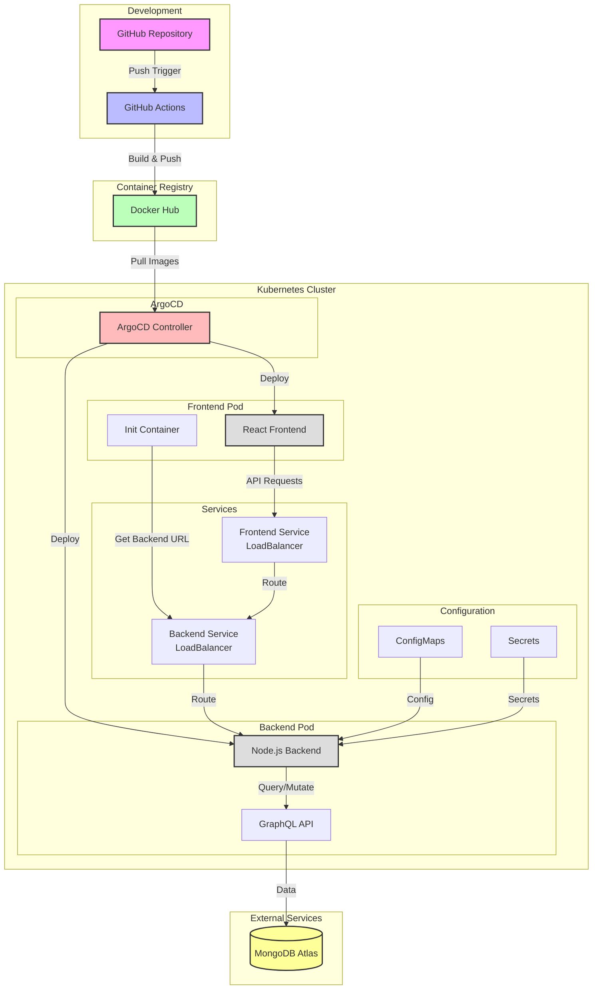

# DevOps Project Presentation: Containerized MERN Project Management System

## 1. Introduction (2-3 minutes)
- Project overview: A full-stack Project Management System built with MERN stack
- Business need: Streamlined project and client management using modern technologies
- Key technologies:
  - Docker for containerization
  - Kubernetes for orchestration
  - ArgoCD for GitOps deployment
  - MERN Stack (MongoDB, Express.js, React, Node.js)
  - GraphQL for efficient API queries

## 2. Architecture Overview (3-4 minutes)
- High-level system architecture:
  - Frontend: React-based client application
  - Backend: Node.js/Express server with GraphQL
  - Database: MongoDB
  - Container orchestration: Kubernetes
  - GitOps deployment: ArgoCD
- Application workflow:
  - Microservices architecture with separate frontend and backend containers
  - GraphQL API for optimized data fetching
  - Continuous deployment through GitHub Actions and ArgoCD

## 3. Technical Implementation (5-7 minutes)
- Containerization strategy:
  - Multi-container setup with separate containers for frontend, backend, and database
  - Docker Compose for local development
  - Optimized Dockerfile with multi-stage builds
  
- Kubernetes Implementation:
  - Deployment manifests in k8s/ directory
  - Service definitions for internal communication
  - ConfigMaps and Secrets management
  
- CI/CD Pipeline:
  - GitHub Actions for automated builds
  - Docker Hub for container registry
  - ArgoCD for GitOps-based deployments
  - Automated testing and quality checks

## 4. Demo (5-6 minutes)
- Live demonstration:
  - Project and client management interface
  - GraphQL queries and mutations
  - Real-time deployment updates
  - Container orchestration in action

## 5. Challenges and Solutions (2-3 minutes)
- Technical challenges:
  - Container orchestration complexity
  - GraphQL implementation and optimization
  - Multi-stage deployment pipeline
- Solutions implemented:
  - Kubernetes for container management
  - Efficient GraphQL schema design
  - Automated deployment processes

## 6. Future Improvements (1-2 minutes)
- Planned enhancements:
  - Enhanced monitoring and logging
  - Horizontal scaling capabilities
  - Additional project management features
  - Performance optimizations

## 7. Q&A Session (3-5 minutes)
- Open for questions about:
  - Technical architecture
  - Implementation decisions
  - DevOps practices
  - Future roadmap

##Technical Deep Dives:

Add code snippet examples for:

GitHub Actions workflow and docker build and push:
name: Docker Build and Push
on:
  push:
    branches:
      - main
env:
  DOCKER_IMAGE_SERVER: simonjan2/project-management
  DOCKER_IMAGE_CLIENT: simonjan2/project-management
jobs:
  build-server:
    runs-on: ubuntu-latest
    steps:
      - name: Checkout code
        uses: actions/checkout@v4
        with:
          fetch-depth: 0

      # Configure Git first
      - name: Configure Git
        run: |
          git config --global user.name 'GitHub Actions'
          git config --global user.email 'github-actions@github.com'
          git config --global pull.rebase true

      - name: Set up Docker Buildx
        uses: docker/setup-buildx-action@v3
     
      - name: Login to Docker Hub
        uses: docker/login-action@v3
        with:
          username: ${{ vars.DOCKERHUB_USERNAME }}
          password: ${{ secrets.DOCKERHUB_TOKEN }}
     
      - name: Build and push server image
        uses: docker/build-push-action@v5
        with:
          context: ./server
          file: ./server/Dockerfile
          push: true
          tags: |
            ${{ env.DOCKER_IMAGE_SERVER }}:server
          cache-from: type=registry,ref=${{ env.DOCKER_IMAGE_SERVER }}:server
          cache-to: type=inline

      - name: Update kubernetes manifests
        run: |
          git pull origin main
          timestamp=$(date -u +"%Y-%m-%dT%H:%M:%SZ")
          sed -i "s|kubectl.kubernetes.io/restartedAt: '.*'|kubectl.kubernetes.io/restartedAt: '$timestamp'|" k8s/backend.yaml
          git add k8s/backend.yaml
          git commit -m "Update backend deployment timestamp for new image" || echo "No changes to commit"
          git push origin main

  build-client:
    needs: [build-server]
    runs-on: ubuntu-latest
    steps:
      - name: Checkout code
        uses: actions/checkout@v4
        with:
          fetch-depth: 0

      # Configure Git first
      - name: Configure Git
        run: |
          git config --global user.name 'GitHub Actions'
          git config --global user.email 'github-actions@github.com'
          git config --global pull.rebase true

      - name: Set up Docker Buildx
        uses: docker/setup-buildx-action@v3
     
      - name: Login to Docker Hub
        uses: docker/login-action@v3
        with:
          username: ${{ vars.DOCKERHUB_USERNAME }}
          password: ${{ secrets.DOCKERHUB_TOKEN }}
     
      - name: Build and push client image
        uses: docker/build-push-action@v5
        with:
          context: ./client
          file: ./client/Dockerfile
          push: true
          tags: |
            ${{ env.DOCKER_IMAGE_CLIENT }}:client
          cache-from: type=registry,ref=${{ env.DOCKER_IMAGE_CLIENT }}:client
          cache-to: type=inline

      - name: Update kubernetes manifests
        run: |
          git pull origin main
          timestamp=$(date -u +"%Y-%m-%dT%H:%M:%SZ")
          sed -i "s|kubectl.kubernetes.io/restartedAt: '.*'|kubectl.kubernetes.io/restartedAt: '$timestamp'|" k8s/frontend.yaml
          git add k8s/frontend.yaml
          git commit -m "Update frontend deployment timestamp for new image" || echo "No changes to commit"
          git push origin main

Key Kubernetes manifest:
frontend:
apiVersion: apps/v1
kind: Deployment
metadata:
  name: frontend
spec:
  replicas: 1
  selector:
    matchLabels:
      app: frontend
  template:
    metadata:
      annotations:
          kubectl.kubernetes.io/restartedAt: '2025-01-01T20:33:47Z'
      labels:
        app: frontend
    spec:
      serviceAccountName: frontend-sa
      volumes:
      - name: shared-data
        emptyDir: {}
      - name: init-script
        configMap:
          name: init-script
          defaultMode: 0777
      initContainers:
      - name: wait-for-backend
        image: bitnami/kubectl
        command: ["/bin/sh"]
        args: ["/scripts/get-backend-url.sh"]
        volumeMounts:
        - name: shared-data
          mountPath: /shared
        - name: init-script
          mountPath: /scripts
      containers:
      - name: frontend
        image: simonjan2/project-management:client
        imagePullPolicy: Always
        ports:
        - containerPort: 3000
        volumeMounts:
        - name: shared-data
          mountPath: /shared
        command: ["/bin/sh", "-c"]
        args:
        - |
          if [ -f /shared/backend-url ]; then
            export REACT_APP_CLIENT_GRAPHQL=$(cat /shared/backend-url)
            export HOST=0.0.0.0
            export PORT=3000
            export WDS_SOCKET_PORT=0
          fi
          npm start
---
apiVersion: v1
kind: Service
metadata:
  name: frontend-service
spec:
  selector:
    app: frontend
  ports:
    - protocol: TCP
      port: 80
      targetPort: 3000
  type: LoadBalancer

backend:
apiVersion: apps/v1
kind: Deployment
metadata:
  name: backend
spec:
  replicas: 1
  selector:
    matchLabels:
      app: backend
  template:
    metadata:
      annotations:
          kubectl.kubernetes.io/restartedAt: '2025-01-01T20:33:25Z'
      labels:
        app: backend
    spec:
      containers:
      - name: backend
        image: simonjan2/project-management:server
        imagePullPolicy: Always
        ports:
        - containerPort: 5000
        env:
        - name: MONGO_URI
          valueFrom:
            configMapKeyRef:
              name: project-management-config
              key: MONGO_URI
        - name: PORT
          valueFrom:
            configMapKeyRef:
              name: project-management-config
              key: PORT
        - name: NODE_ENV
          valueFrom:
            configMapKeyRef:
              name: project-management-config
              key: NODE_ENV
        - name: JWT_SECRET
          valueFrom:
            secretKeyRef:
              name: project-management-secret
              key: JWT_SECRET
        - name: JWT_EXPIRE
          valueFrom:
            secretKeyRef:
              name: project-management-secret
              key: JWT_EXPIRE
---
apiVersion: v1
kind: Service
metadata:
  name: backend-service
spec:
  selector:
    app: backend
  ports:
    - protocol: TCP
      port: 5000
      targetPort: 5000
  type: LoadBalancer

# add a flow diagram showing the complete system architecture:
# Project Management System Architecture

## Complete System Architecture Flow

## Architecture Components Description

1. **Development Environment**
   - GitHub repository hosts the source code
   - GitHub Actions handles CI/CD pipeline
   - Automated builds and tests on push to main branch

2. **Container Registry**
   - Docker Hub stores container images
   - Separate repositories for frontend and backend images
   - Tagged versions for deployment tracking

3. **Kubernetes Cluster**
   - **ArgoCD**
     - Manages GitOps-based deployments
     - Monitors repository for changes
     - Automatically syncs cluster state

   - **Frontend Deployment**
     - React application container
     - Init container for backend service discovery
     - LoadBalancer service for external access

   - **Backend Deployment**
     - Node.js server with GraphQL
     - Environment configuration via ConfigMaps
     - Secure data via Kubernetes Secrets
     - LoadBalancer service for API access

4. **External Services**
   - MongoDB Atlas for persistent data storage
   - Secure connection via configuration

## Data Flow

1. User requests reach the frontend service
2. Frontend service routes to React application
3. React app makes GraphQL queries to backend service
4. Backend processes requests through GraphQL API
5. Data is persisted in MongoDB Atlas
6. Changes are reflected back to the user interface

## Deployment Flow

1. Code changes pushed to GitHub
2. GitHub Actions builds new container images
3. Images are pushed to Docker Hub
4. ArgoCD detects changes in manifests
5. Kubernetes cluster is updated with new deployments
6. Rolling updates ensure zero-downtime deployments

