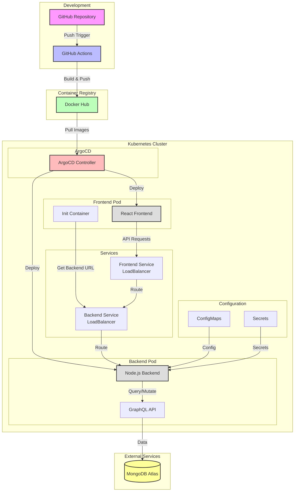

# Project Management System Architecture

## Complete System Architecture Flow

## Architecture Components Description

1. **Development Environment**
   - GitHub repository hosts the source code
   - GitHub Actions handles CI/CD pipeline
   - Automated builds and tests on push to main branch

2. **Container Registry**
   - Docker Hub stores container images
   - Separate repositories for frontend and backend images
   - Tagged versions for deployment tracking

3. **Kubernetes Cluster**
   - **ArgoCD**
     - Manages GitOps-based deployments
     - Monitors repository for changes
     - Automatically syncs cluster state

   - **Frontend Deployment**
     - React application container
     - Init container for backend service discovery
     - LoadBalancer service for external access

   - **Backend Deployment**
     - Node.js server with GraphQL
     - Environment configuration via ConfigMaps
     - Secure data via Kubernetes Secrets
     - LoadBalancer service for API access

4. **External Services**
   - MongoDB Atlas for persistent data storage
   - Secure connection via configuration

## Data Flow

1. User requests reach the frontend service
2. Frontend service routes to React application
3. React app makes GraphQL queries to backend service
4. Backend processes requests through GraphQL API
5. Data is persisted in MongoDB Atlas
6. Changes are reflected back to the user interface

## Deployment Flow

1. Code changes pushed to GitHub
2. GitHub Actions builds new container images
3. Images are pushed to Docker Hub
4. ArgoCD detects changes in manifests
5. Kubernetes cluster is updated with new deployments
6. Rolling updates ensure zero-downtime deployments
